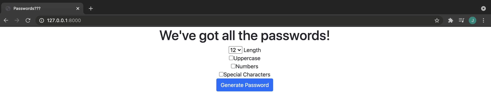
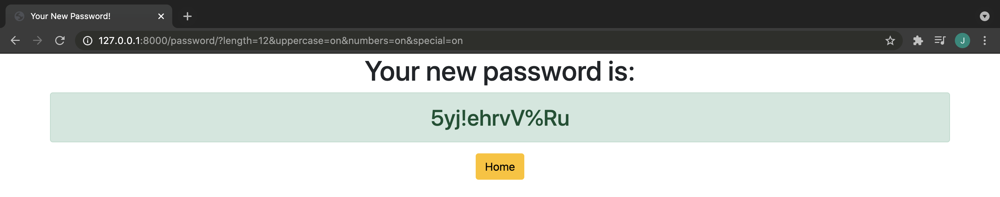

# Password Generator Site

A slightly ugly password generator, built with Django and Bootstrap! Good way to get started with Django :)




## How to Use

1) ```git clone``` this project
2) ```cd django_password_generator```
3) Run ```python3 manage.py runserver```
4) Go to ```http://127.0.0.1:8000/```
5) Feast on aalll the passwords!